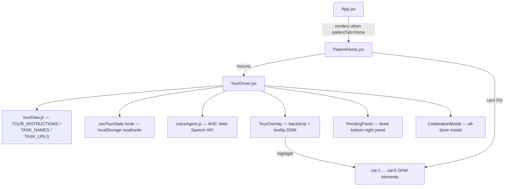
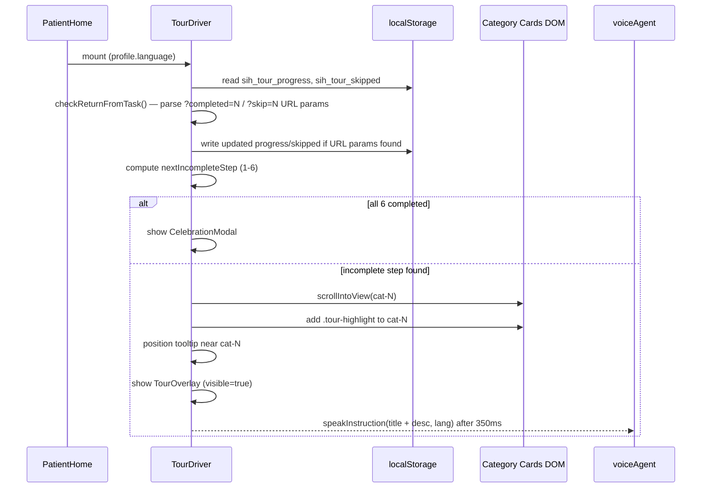
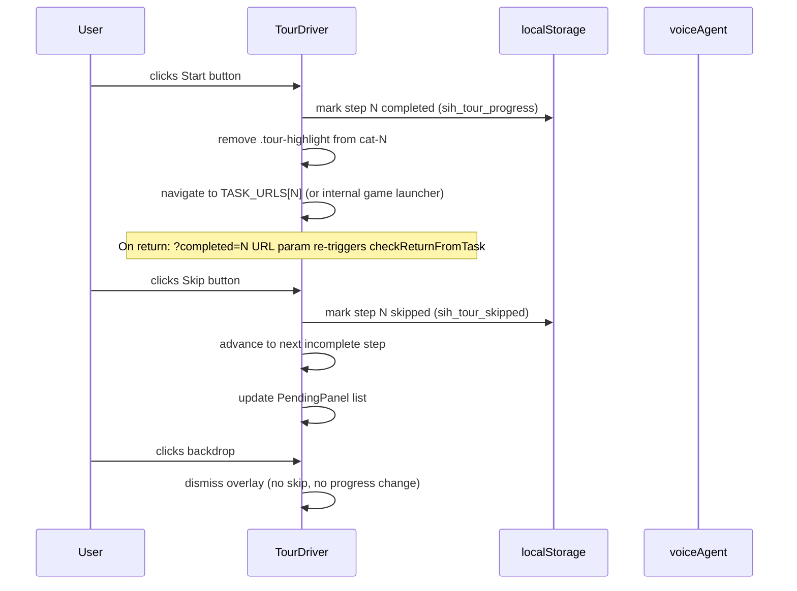

# Design Document: Guided Tour Driver + Voice Agent

## Overview

The Guided Tour Driver + Voice Agent system ports and adapts the step-by-step onboarding tour from the old `app.js`/`style.css` brainboost app into the current Smriti Saathi React/Vite architecture. It walks the patient user through the 6 cognitive category cards one at a time with a floating tooltip, optional multilingual TTS speech, a pending-tasks panel, a celebration modal, and localStorage progress tracking — all integrated cleanly as a standalone `TourDriver` component mounted inside `PatientHome`.

---

## Architecture



**Key architectural decisions:**

- `TourDriver` is a **self-contained component** dropped into `PatientHome` as a single import. It touches no other existing components.
- Tour uses **imperative DOM positioning** (`getBoundingClientRect`) for tooltip placement — the same technique as the original app — because the 6 category cards are rendered by an existing `PatientHome` section whose JSX we cannot restructure.
- Voice synthesis lives in a separate **`voiceAgent.js` utility module** so it can be unit-tested and swapped independently of the tour logic.
- All multilingual tour copy lives in **`tourData.js`** — a single source of truth that maps task index × language to `{ title, desc }`.

---

## Sequence Diagrams

### Tour Startup Flow



### Tour Step Progression



---

## Components and Interfaces

### Component 1: TourDriver

**Purpose:** Root orchestrator — owns all tour state, mounts overlay/panel/modal, drives step logic.

**Location:** `src/components/patient/TourDriver.jsx`

**Interface:**
```typescript
interface TourDriverProps {
  language: string;           // e.g. "hi" | "en" | "as" | "mni" | "nag"
  onLaunchGame?: (taskIndex: number) => void; // optional — navigate inside React instead of href
}
```

**Responsibilities:**
- Read and persist tour progress in localStorage (`sih_tour_progress`, `sih_tour_skipped`).
- On mount, parse URL params `?completed=N` / `?skip=N` and update storage, then strip params from URL.
- Determine current active step; position tooltip over the correct category card DOM element.
- Delegate speech to `voiceAgent.js`.
- Expose imperative `resetAllProgress()` (callable via a hidden dev button or ref).

---

### Component 2: TourOverlay

**Purpose:** Semi-transparent backdrop + floating tooltip bubble.

**Rendered inside:** `TourDriver` (inline JSX, no separate file needed).

**Interface (internal state shape):**
```typescript
interface TourOverlayState {
  visible: boolean;
  step: number;              // 1–6, current highlighted task
  tooltipStyle: {            // pixel position computed from getBoundingClientRect
    top: number;
    left: number;
  };
  lang: string;
}
```

**DOM IDs emitted** (required for original CSS selectors and potential external targeting):
- `#tourOverlay`, `#tourBackdrop`, `#tourTooltip`
- `#tourStepBadge`, `#tourVoiceBtn`, `#tourTitle`, `#tourDesc`
- `#tourProgress`, `#tourProgressFill`
- `#tourSkipBtn`, `#tourStartBtn`, `#tourStartText`

---

### Component 3: PendingPanel

**Purpose:** Fixed bottom-right panel listing skipped-but-incomplete tasks with Start links.

**Rendered inside:** `TourDriver`.

**DOM IDs emitted:** `#pendingPanel`, `#pendingList`, `#pendingClose`

---

### Component 4: CelebrationModal

**Purpose:** Full-screen celebration when all 6 tasks are completed.

**DOM ID emitted:** `#tourCelebration`, `#celebrationClose`

---

### Component 5: voiceAgent (utility module)

**Location:** `src/utils/voiceAgent.js`

**Interface:**
```typescript
function speakInstruction(text: string, lang: string): void
function stopVoice(): void
function stripEmojis(text: string): string
```

---

## Data Models

### TourInstructionMap

```typescript
type TourInstruction = {
  title: string;   // short heading for tooltip title bar
  desc: string;    // 1–2 sentence description spoken and shown
};

type TourInstructionMap = {
  [taskIndex: 1 | 2 | 3 | 4 | 5 | 6]: {
    hi: TourInstruction;
    en: TourInstruction;
    as?: TourInstruction;   // optional; falls back to "en"
    mni?: TourInstruction;
    nag?: TourInstruction;
  };
};
```

**Location:** `src/data/tourData.js`

---

### TourProgressState (localStorage keys)

```typescript
// sih_tour_progress — JSON array of completed task indices
type TourProgress = number[];   // e.g. [1, 2] means tasks 1 and 2 done

// sih_tour_skipped — JSON array of skipped task indices
type TourSkipped = number[];    // e.g. [3] means task 3 was skipped
```

---

### TaskURLMap

In the old app, tasks navigated to separate HTML pages. In the React app, tasks open the existing `AllGamesEngine` via `onStartTask`. The mapping is:

```typescript
const TASK_GAME_MAP: Record<number, string> = {
  1: "memory",         // memory_improvement domain
  2: "attention",      // attention_concentration domain
  3: "daily_routine",  // daily_routine_recall domain
  4: "pattern",        // pattern_recognition domain
  5: "object",         // object_recognition domain
  6: "emotional",      // emotional_mental_engagement domain
};
```

When `onLaunchGame` prop is provided, `TourDriver` calls `onLaunchGame(taskIndex)` instead of navigating to an external URL.

---

## Algorithmic Pseudocode

### Main Tour Initialization Algorithm

```pascal
ALGORITHM initTour(language, onLaunchGame)
INPUT: language: string, onLaunchGame: fn|undefined
OUTPUT: initialTourState

BEGIN
  progress ← readLocalStorage("sih_tour_progress") OR []
  skipped  ← readLocalStorage("sih_tour_skipped")  OR []

  // Handle return from task via URL params
  params ← parseURLSearchParams(window.location.search)
  IF params.has("completed") THEN
    n ← parseInt(params.get("completed"))
    progress ← UNION(progress, [n])
    writeLocalStorage("sih_tour_progress", progress)
  END IF
  IF params.has("skip") THEN
    n ← parseInt(params.get("skip"))
    skipped ← UNION(skipped, [n])
    writeLocalStorage("sih_tour_skipped", skipped)
  END IF
  cleanURLParams()  // replaceState to strip ?completed / ?skip

  nextStep ← findNextIncompleteStep(progress, 1..6)

  IF nextStep = null THEN
    RETURN { showCelebration: true }
  ELSE
    RETURN { activeStep: nextStep, progress, skipped, visible: true }
  END IF
END
```

**Preconditions:**
- `localStorage` is accessible (browser environment)
- Category card DOM elements `#cat-1` … `#cat-6` are mounted before `initTour` runs (enforced by `useEffect` dependency on mount)

**Postconditions:**
- URL params `?completed` / `?skip` are consumed and removed from address bar
- `sih_tour_progress` and `sih_tour_skipped` reflect the latest state
- Returned state drives first render of TourOverlay or CelebrationModal

---

### Tooltip Positioning Algorithm

```pascal
ALGORITHM positionTooltip(stepIndex)
INPUT: stepIndex: 1..6
OUTPUT: { top: px, left: px } — CSS pixel position for tooltip

BEGIN
  cardEl ← document.getElementById("cat-" + stepIndex)
  IF cardEl = null THEN RETURN { top: 120, left: 16 } END IF

  rect ← cardEl.getBoundingClientRect()
  viewH ← window.innerHeight
  viewW ← window.innerWidth

  tooltipW ← 300   // fixed tooltip width px
  tooltipH ← 220   // estimated tooltip height px
  margin  ← 12

  // Prefer below the card; fall back to above if too close to bottom
  IF rect.bottom + tooltipH + margin < viewH THEN
    top  ← rect.bottom + margin + window.scrollY
  ELSE
    top  ← rect.top - tooltipH - margin + window.scrollY
  END IF

  // Centre horizontally on card; clamp inside viewport
  left ← rect.left + (rect.width / 2) - (tooltipW / 2)
  left ← MAX(8, MIN(left, viewW - tooltipW - 8))

  RETURN { top, left }
END
```

**Loop Invariants:** N/A (no loops)

**Postconditions:**
- Returned `top` and `left` keep the tooltip fully within the viewport
- Card `#cat-{stepIndex}` receives `.tour-highlight` class before this is called

---

### Voice Instruction Algorithm

```pascal
ALGORITHM speakInstruction(text, lang)
INPUT: text: string, lang: string (e.g. "hi", "en", "as")
OUTPUT: void (side-effect: TTS utterance queued)

CONST LangBCP47 ← {
  hi: "hi-IN",
  en: "en-US",
  as: "as-IN",
  mni: "bn-IN",   // fallback — Meitei not in W3C set
  nag: "en-IN"
}

BEGIN
  IF window.speechSynthesis = undefined THEN RETURN END IF
  
  window.speechSynthesis.cancel()  // stop any in-progress speech
  
  cleaned ← stripEmojis(text)       // remove emoji, preserve Devanagari / Indic
  bcp47   ← LangBCP47[lang] OR "en-US"
  
  utterance ← new SpeechSynthesisUtterance(cleaned)
  utterance.lang ← bcp47
  
  // Pick best matching voice
  voices ← window.speechSynthesis.getVoices()
  preferred ← voices.find(v => v.lang = bcp47)
               OR voices.find(v => v.lang.startsWith(bcp47.substring(0,2)))
               OR null
  IF preferred ≠ null THEN
    utterance.voice ← preferred
  END IF
  
  utterance.rate ← 0.88   // slightly slower for elderly comprehension
  utterance.pitch ← 1.0
  
  window.speechSynthesis.speak(utterance)
END
```

**Preconditions:**
- Called after a 350 ms delay post-overlay animation (ensures browser speech queue is clear)
- `stripEmojis` must preserve Unicode ranges U+0900–U+097F (Devanagari), U+0980–U+09FF (Bengali/Assamese), U+0A00–U+0A7F (Gurmukhi), U+0ABС–U+0AFF (Gujarati), U+0B00–U+0B7F (Odia), U+0C00–U+0C7F (Telugu), U+0D00–U+0D7F (Malayalam), U+0E00–U+0E7F (Thai — not needed but safe to keep)

**Postconditions:**
- Any prior speech is cancelled before new utterance starts
- Voice selection degrades gracefully if preferred locale voice is unavailable

---

### Step Transition Algorithm

```pascal
ALGORITHM advanceToStep(nextStep, progress, skipped, onLaunchGame)
INPUT: nextStep: 1..6|null
OUTPUT: updated tour state

BEGIN
  // Remove highlight from previously highlighted card
  FOR i IN 1..6 DO
    document.getElementById("cat-" + i).classList.remove("tour-highlight")
  END FOR

  IF nextStep = null THEN
    // All tasks done
    RETURN { showCelebration: true, visible: false }
  END IF

  cardEl ← document.getElementById("cat-" + nextStep)
  cardEl.classList.add("tour-highlight")
  cardEl.scrollIntoView({ behavior: "smooth", block: "center" })
  
  tooltipPos ← positionTooltip(nextStep)
  
  RETURN {
    activeStep: nextStep,
    tooltipStyle: tooltipPos,
    visible: true
  }
END
```

---

## Key Functions with Formal Specifications

### `findNextIncompleteStep(progress, skipped)`

```typescript
function findNextIncompleteStep(
  progress: number[],
  skipped: number[]
): number | null
```

**Preconditions:**
- `progress` and `skipped` are arrays of integers in range 1–6
- A step is "complete" if it appears in `progress`

**Postconditions:**
- Returns the lowest task index (1–6) not in `progress`
- Returns `null` if all 6 tasks are in `progress`
- Skipped steps that are not yet completed are still returned (user must eventually complete or permanently skip)

---

### `handleSkip(stepIndex)`

```typescript
function handleSkip(stepIndex: number): void
```

**Preconditions:** `stepIndex` ∈ {1, 2, 3, 4, 5, 6}

**Postconditions:**
- `stepIndex` appended to `sih_tour_skipped` in localStorage (idempotent)
- Tour advances to next incomplete step (calls `advanceToStep`)
- Pending panel is re-derived from updated skipped list

---

### `handleStart(stepIndex)`

```typescript
function handleStart(stepIndex: number): void
```

**Preconditions:** `stepIndex` ∈ {1, 2, 3, 4, 5, 6}

**Postconditions:**
- If `onLaunchGame` prop provided: overlay dismissed, `onLaunchGame(stepIndex)` called
- Else: window navigates to `TASK_URLS[stepIndex]` with `?completed={stepIndex}` query param appended
- `.tour-highlight` removed from card before navigation

---

### `stripEmojis(text: string): string`

**Preconditions:** `text` is any string

**Postconditions:**
- All Unicode emoji code points in ranges U+1F300–U+1FAFF, U+2600–U+27BF, U+2300–U+23FF, U+FE00–U+FEFF are removed
- Devanagari, Bengali/Assamese, and other Indic script ranges are preserved
- Resultant string has no leading/trailing whitespace from removed emoji

---

## Example Usage

```jsx
// PatientHome.jsx — adding TourDriver

import { TourDriver } from './TourDriver';

export const PatientHome = ({ profile, tasks, onStartTask, ... }) => {
  // Existing JSX remains unchanged.
  // Category cards must have id="cat-1" through id="cat-6" added.

  const handleTourLaunchGame = (taskIndex) => {
    // taskIndex 1–6 maps to cognitive domain; find best matching task
    const domainMap = {
      1: 'memory', 2: 'attention', 3: 'daily_routine',
      4: 'pattern', 5: 'object', 6: 'emotional'
    };
    const domain = domainMap[taskIndex];
    const match = tasks.find(t =>
      t.domain?.toLowerCase().includes(domain) && t.status !== 'completed'
    ) ?? tasks[0];
    onStartTask(match);
  };

  return (
    <div className="max-w-md mx-auto ...">
      {/* TourDriver mounts here — renders portals into document.body */}
      <TourDriver
        language={profile.language}
        onLaunchGame={handleTourLaunchGame}
      />

      {/* Greeting, hero card, etc. remain unchanged */}
      ...

      {/* Games section — cat-1 through cat-6 IDs added */}
      <div id="cat-1" className="...">Memory Enhancement card</div>
      <div id="cat-2" className="...">Attention & Focus card</div>
      <div id="cat-3" className="...">Daily Routines card</div>
      <div id="cat-4" className="...">Pattern Recognition card</div>
      <div id="cat-5" className="...">Object Identification card</div>
      <div id="cat-6" className="...">Emotional Engagement card</div>
    </div>
  );
};
```

```javascript
// src/utils/voiceAgent.js — basic usage
import { speakInstruction, stopVoice } from '../../utils/voiceAgent';

// Speak a tour step
speakInstruction("स्मृति सुधार। मेमोरी कार्ड जोड़े खोजें।", "hi");

// Stop speech on unmount
stopVoice();
```

```javascript
// src/data/tourData.js — tour instruction lookup
import { TOUR_INSTRUCTIONS, TASK_NAMES } from '../../data/tourData';

const step = 1;
const lang = 'hi';
const fallback = 'en';

const instruction =
  TOUR_INSTRUCTIONS[step][lang] ?? TOUR_INSTRUCTIONS[step][fallback];
// => { title: "स्मृति सुधार", desc: "मेमोरी कार्ड, चित्र याद..." }
```

---

## Correctness Properties

*A property is a characteristic or behavior that should hold true across all valid executions of a system — essentially, a formal statement about what the system should do. Properties serve as the bridge between human-readable specifications and machine-verifiable correctness guarantees.*

### Property 1: Progress Completeness

For any array `progress` ⊆ {1, 2, 3, 4, 5, 6}, `findNextIncompleteStep(progress)` returns `null` if and only if `progress` contains all 6 indices; otherwise it returns the minimum integer in {1..6} not present in `progress`.

**Validates: Requirements 1.1, 7.1**

### Property 2: Emoji Stripping Preserves Indic Scripts

For any string `s`, `stripEmojis(s).length ≤ s.length` and every character in `stripEmojis(s)` that was in a Devanagari or other Indic Unicode block in `s` is preserved in the output.

**Validates: Requirements 3.4**

### Property 3: Tooltip Viewport Containment

For any viewport width `W` and any card bounding rectangle `rect`, `positionTooltip` produces a `left` value such that `left ≥ 8` and `left + 300 ≤ W − 8`.

**Validates: Requirements 5.4**

### Property 4: Single Active Highlight

After any sequence of `handleSkip` and `handleStart` calls, at most one DOM element carries the `.tour-highlight` CSS class at any point in time.

**Validates: Requirements 2.6**

### Property 5: Voice Cancel-Before-Speak Idempotency

For any call to `speakInstruction(text, lang)`, `window.speechSynthesis.cancel()` is always invoked before `window.speechSynthesis.speak(utterance)`, ensuring no two utterances ever overlap.

**Validates: Requirements 3.2**

### Property 6: Language Fallback Completeness

For any step index in {1..6} and any language code, if `TOUR_INSTRUCTIONS[step][lang]` is `undefined`, the system resolves `TOUR_INSTRUCTIONS[step]['en']` which is always defined — the English fallback is never absent.

**Validates: Requirements 4.1, 4.3**

### Property 7: PendingPanel Reflects Skipped-Not-Completed Set

For any combination of `progress` and `skipped` arrays, the set of items displayed in PendingPanel equals exactly `{n ∈ skipped | n ∉ progress}` — no more, no fewer.

**Validates: Requirements 6.1, 6.2**

### Property 8: handleSkip Advances to Next Incomplete Step

For any current step N and any initial progress/skipped state, calling `handleSkip(N)` results in the tour advancing to the minimum step index in {1..6} not present in the updated progress array (i.e., `findNextIncompleteStep` is invoked on the post-skip state and its result becomes the new active step, or the CelebrationModal is shown if the result is null).

**Validates: Requirements 2.4, 6.1**

---

## Error Handling

### Speech Synthesis Unavailable

**Condition:** `window.speechSynthesis` is `undefined` (iOS WKWebView, some Android WebViews).  
**Response:** `speakInstruction` is a no-op; voice button in tooltip remains visible but does nothing.  
**Recovery:** Tour continues normally without audio; visual tooltip is the primary interaction.

---

### Category Card DOM Element Missing

**Condition:** `document.getElementById("cat-N")` returns `null` (card filtered out, not yet rendered).  
**Response:** `positionTooltip` returns a safe fallback position `{ top: 120, left: 16 }`. `advanceToStep` skips the highlight class application.  
**Recovery:** Tour tooltip still appears; user can skip or start. Next React render cycle will resolve the missing element.

---

### localStorage Unavailable (Private Browsing / Storage Full)

**Condition:** `localStorage.setItem` throws `SecurityError` or `QuotaExceededError`.  
**Response:** Try/catch silently swallows the error; tour operates in-memory for the session only.  
**Recovery:** Progress resets on page reload; this is an acceptable degradation for a non-critical onboarding feature.

---

### Voice List Empty on First Load

**Condition:** `speechSynthesis.getVoices()` returns `[]` on first call (async initialization in Chrome).  
**Response:** Attach a `voiceschanged` event listener; retry voice selection when voices become available.  
**Recovery:** Utterance falls back to browser default voice if preferred voice still not found.

---

## Testing Strategy

### Unit Testing Approach

Test pure logic functions in isolation:

| Function | Test cases |
|---|---|
| `findNextIncompleteStep` | Empty progress → returns 1; all done → returns null; gaps in middle → returns lowest gap |
| `stripEmojis` | Emoji-only string → ""; mixed emoji + Devanagari → Devanagari preserved; ASCII → unchanged |
| `positionTooltip` | Card near bottom → tooltip above; card near top → tooltip below; card off-screen → fallback |
| `initTour` with URL params | `?completed=3` → step 3 added to progress and URL cleaned |

**Library:** Vitest (already in project via Vite ecosystem)

---

### Property-Based Testing Approach

**Property Test Library:** fast-check

**Properties to test:**

1. `findNextIncompleteStep` — for any subset of {1…6} marked complete, result is always either `null` or the minimum value in the complement set.
2. `stripEmojis` — for any string, the output length ≤ input length, and all characters in output are non-emoji.
3. `positionTooltip` — for any viewport dimensions and card rect, returned `left + 300 ≤ viewportWidth − 8` always holds.

---

### Integration Testing Approach

- Mount `TourDriver` in a `jsdom` environment with mocked `#cat-1` … `#cat-6` elements.
- Simulate `Skip` click → verify localStorage updated and next card highlighted.
- Simulate `Start` click with `onLaunchGame` spy → verify spy called with correct task index.
- Simulate all 6 tasks completed → verify `CelebrationModal` rendered.

---

## CSS Architecture

All tour styles are isolated in a new file: `src/components/patient/TourDriver.css`

### Key CSS Classes

```css
/* Overlay & Backdrop */
.tour-overlay     — fixed, full-screen, pointer-events none by default
.tour-backdrop    — rgba(0,0,0,0.45) background, pointer-events auto (dismisses on click)
.tour-tooltip     — white card, absolute-positioned, z-index 10001, box-shadow

/* Tooltip internals */
.tour-tooltip__top-row   — flex row: step badge + voice button
.tour-tooltip__step-badge — teal pill "Step N of 6"
.tour-voice-btn          — circular voice icon button
.tour-progress-bar       — thin progress track
.tour-progress-fill      — animated fill based on step/6

/* Action buttons */
.tour-skip-btn    — ghost/outlined button
.tour-start-btn   — teal filled CTA button with pulse animation

/* Card highlight */
.tour-highlight   — glowing teal border + box-shadow animation
@keyframes tourCardGlow — pulsing glow cycle (0% → 50% → 100% box-shadow)
@keyframes tourTooltipBtnPulse — scale + glow pulse on start button

/* Completion badges on cards */
.cat-card--completed     — subtle green overlay on card
.cat-card__done-badge    — ✓ green badge top-right of card
.cat-card--skipped       — amber/orange overlay  
.cat-card__skip-badge    — ↩ amber badge top-right

/* Pending panel */
.pending-panel           — fixed bottom-right, rounded card, z-index 9999
.pending-panel__header   — title row with close button
.pending-panel__item     — flex row: task name + Start link

/* Celebration modal */
.tour-celebration        — fixed inset overlay, z-index 10002
.celebration-content     — centered white card with confetti animation
```

---

## Performance Considerations

- `TourDriver` renders exactly **zero DOM nodes** when the tour is fully completed and `showCelebration=false` — it returns `null`.
- Tooltip positioning uses a single `getBoundingClientRect()` call per step; no layout thrashing.
- `ResizeObserver` on the window repositions the tooltip on viewport resize without a polling loop.
- `voiceAgent.js` uses a lazy voice-list strategy — voices are fetched once on first `speakInstruction` call and cached in module scope.
- No new npm dependencies required — the W3C Web Speech API is native to all modern browsers and `canvas-confetti` (already in `package.json`) powers the celebration screen.

---

## Security Considerations

- All localStorage values are JSON-parsed with `try/catch`; malformed values fall back to `[]` to prevent XSS via poisoned storage keys.
- `speakInstruction` takes a plain text string; it never inserts content into the DOM, so there is no HTML injection surface.
- `TOUR_INSTRUCTIONS` content is static data defined in source — not user-supplied — so no sanitization is needed for the TTS text.

---

## Dependencies

| Dependency | Source | Purpose |
|---|---|---|
| `react`, `react-dom` | existing | Component lifecycle, `createPortal` for overlay |
| `canvas-confetti` | existing (`package.json`) | Celebration modal confetti burst |
| `W3C Web Speech API` | browser built-in | TTS voice synthesis |
| `localStorage` | browser built-in | Progress and skip persistence |
| `lucide-react` | existing | Voice icon (`Volume2`), skip icon (`SkipForward`), celebration icon (`PartyPopper`) |

No new npm packages are required.
